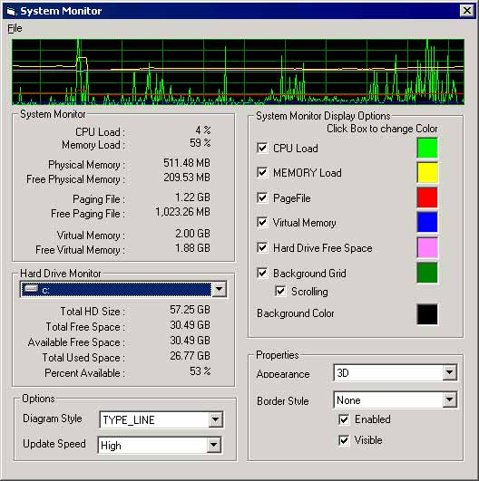

<div align="center">

## Complete System Monitor Usercontrol


</div>

### Description

Having seen so many code snips that either only work with Windows9x or return incorrect values, I decided to write one that should work accross ALL version of Windows. I was able to find multiple pieces of code all over the place and assembled them into a neat little ActiveX control.

This usercontrol can be be used visually, and optionally display the history of any if the following values;

CPU Load %, Memory Load %, Free Pagefile %, Free Virtual Memory % and the HD Free space %.

The control can also be hidden and used to manually retrieve the values below using the GetCurrentSystemLevels routine. This allows you to retrieve current system levels and isplay the information using your own layout/design;

CPULoadPercent, MemoryLoadPercent, PhysicalMemoryTotal, PhysicalMemoryAvailable, PhysicalMemoryAvailablePercent, PageFileTotal, PageFileAvailable, PageFileAvailablePercent, VirtualMemoryTotal, VirtualMemoryAvailable, VirtualMemoryAvailablePercent, HDTotalBytes, HDTotalFreeBytes, HDAvailableFreeBytes, HDTotalBytesUsed, HDAvailablePercent

The visual look of the control is fully customizable. All colors can be modified to fit the individual needs of developers.
 
### More Info
 


<span>             |<span>
---                |---
**Submitted On**   |2002-01-10 11:12:06
**By**             |[Howard D\. Hull Jr\.](https://github.com/Planet-Source-Code/PSCIndex/blob/master/ByAuthor/howard-d-hull-jr.md)
**Level**          |Intermediate
**User Rating**    |4.9 (163 globes from 33 users)
**Compatibility**  |VB 5\.0, VB 6\.0
**Category**       |[Custom Controls/ Forms/  Menus](https://github.com/Planet-Source-Code/PSCIndex/blob/master/ByCategory/custom-controls-forms-menus__1-4.md)
**World**          |[Visual Basic](https://github.com/Planet-Source-Code/PSCIndex/blob/master/ByWorld/visual-basic.md)
**Archive File**   |[Complete\_S476431102002\.zip](https://github.com/Planet-Source-Code/howard-d-hull-jr-complete-system-monitor-usercontrol__1-30650/archive/master.zip)

### API Declarations

```
Private Declare Function GetVersionEx Lib "Kernel32" Alias "GetVersionExA" (lpVersionInformation As OSVERSIONINFO) As Long
Private Declare Function NtQuerySystemInformation Lib "ntdll" (ByVal dwInfoType As Long, ByVal lpStructure As Long, ByVal dwSize As Long, ByVal dwReserved As Long) As Long
Private Declare Function GetWindowsDirectory Lib "Kernel32" Alias "GetWindowsDirectoryA" (ByVal lpBuffer As String, ByVal nSize As Integer) As Integer
Private Declare Function GetDiskFreeSpace Lib "Kernel32" Alias "GetDiskFreeSpaceA" (ByVal lpRootPathName As String, lpSectorsPerCluster As Long, lpBytesPerSector As Long, lpNumberOfFreeClusters As Long, lpTtoalNumberOfClusters As Long) As Long
Private Declare Function GetDiskFreeSpaceEx Lib "Kernel32" Alias "GetDiskFreeSpaceExA" (ByVal lpRootPathName As String, lpFreeBytesAvailableToCaller As Currency, lpTotalNumberOfBytes As Currency, lpTotalNumberOfFreeBytes As Currency) As Long
Private Declare Function GetProcAddress Lib "Kernel32" (ByVal hModule As Long, ByVal lpProcName As String) As Long
Private Declare Function GetModuleHandle Lib "Kernel32" Alias "GetModuleHandleA" (ByVal lpModuleName As String) As Long
Private Declare Sub GlobalMemoryStatus Lib "Kernel32" (lpBuffer As MEMORYSTATUS)
```


